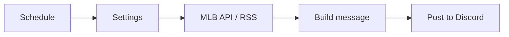

# MetsXMFanZone n8n workflows

Ready-to-import n8n workflows that post New York Mets updates to a Discord
channel and fill Live Stream Management with upcoming New York games. They use
the free MLB Stats API, ESPN's public schedules and the MLB.com Mets news feed,
so you do not need API keys for the schedules.

| File | Schedule | What it posts |
| --- | --- | --- |
| `workflows/01-game-day-alert.json` | Every day, 9 AM ET | Opponent, first pitch time, ballpark and probable pitchers. Handles doubleheaders and postponements. Posts nothing on off days. |
| `workflows/02-final-score.json` | Every 10 minutes | Final score, W/L/SV pitchers and the team record, once per game. |
| `workflows/03-daily-news-digest.json` | Every day, 8 AM ET | Mets headlines from the last 24 hours. |
| `workflows/04-create-live-stream-events.json` | Every day, 6 AM ET | Creates scheduled live stream events for the next 7 days of Mets, Jets, Giants, Knicks, Nets, Rangers and Islanders games. See [Live stream events](#live-stream-events). |



## 1. Start n8n

With Docker installed, run this in this folder:

```bash
docker compose up -d
```

Open <http://localhost:5678> and create your owner account.

## 2. Create a Discord webhook

1. In Discord, open the channel settings.
2. Go to **Integrations > Webhooks > New Webhook**.
3. Click **Copy Webhook URL**.

## 3. Import the workflows

For each JSON file in `workflows/`:

1. In n8n, click **Create workflow**.
2. Open the **...** menu and select **Import from file**.
3. Open the **Settings** node and replace `PASTE_YOUR_DISCORD_WEBHOOK_URL_HERE`
   with your webhook URL.
4. Click **Execute workflow** to test it.
5. Click **Publish** (or turn on **Active**) so that the schedule runs.

You can also import all of them from the command line:

```bash
docker compose exec n8n n8n import:workflow --separate --input=/workflows
```

## Live stream events

`04-create-live-stream-events.json` writes to the `live_streams` table that the
admin **Live Stream Management** page uses, so new games show up there like
events you create by hand.

- Mets games get the Mets stream link, the matching fan art and the **Live
  Page**. Other NY teams get the shared NY team stream link, their team page
  and the **Live Page**.
- Every event is created as **Scheduled**. The site's `auto-stream-status`
  job still decides when a Mets game goes live; other teams stay scheduled
  until you start them, as before.
- Running it again never creates a duplicate. A game that is already in the
  list (by title, or by the same day and opponent) is skipped. If the league
  moves a game's start time, the event's start and end are updated while it is
  still scheduled.
- Postponed, cancelled and finished games are skipped.

To set it up:

1. In n8n, open **Credentials > Add credential > Supabase API**. Name it
   `MetsXMFanZone Supabase`, set **Host** to the project URL and **Service
   Role Secret** to the service role key (Supabase > Project Settings > API).
   The key stays in n8n's encrypted credential store, not in the workflow.
2. Import the workflow and select that credential in the **Get existing
   streams**, **Create live stream** and **Update start time** nodes.
3. In the **Settings** node, check `daysAhead`, the stream links and the
   `teams` list. Set `publish` to `false` if you want to review events before
   they appear on the site.
4. Click **Execute workflow**, then check Live Stream Management.

## Customize

- **Other team:** change `teamId` in each **Settings** node. For team IDs, see
  <https://statsapi.mlb.com/api/v1/teams?sportId=1>.
- **Other times:** change the cron expression in the schedule node.
- **Other destinations:** replace the **Post to Discord** node with a Slack,
  Telegram, Email or X node. Each workflow gives the text in `message`.

## Notes

- The final score workflow remembers posted games only in production runs.
  A manual test run can post the same game again.
- The workflows set their timezone to `America/New_York`.
