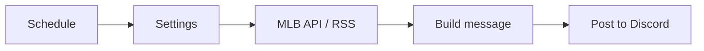

# MetsXMFanZone n8n workflows

Ready-to-import n8n workflows that post New York Mets updates to a Discord
channel. They use the free MLB Stats API and the MLB.com Mets news feed, so you
do not need API keys.

| File | Schedule | What it posts |
| --- | --- | --- |
| `workflows/01-game-day-alert.json` | Every day, 9 AM ET | Opponent, first pitch time, ballpark and probable pitchers. Handles doubleheaders and postponements. Posts nothing on off days. |
| `workflows/02-final-score.json` | Every 10 minutes | Final score, W/L/SV pitchers and the team record, once per game. |
| `workflows/03-daily-news-digest.json` | Every day, 8 AM ET | Mets headlines from the last 24 hours. |
| `workflows/04-stream-health-check.json` | Every 5 minutes | An alert when one of your M3U8 live streams stops playing, and another when it comes back. |



## Run it on your computer (for testing)

With Docker installed, run these in this folder:

```bash
docker compose up -d
./publish-workflows.sh 'https://discord.com/api/webhooks/...'
```

Open <http://localhost:5678> and create your owner account. The three
workflows are already there and published. To get a webhook URL, see
[Create a Discord webhook](#create-a-discord-webhook).

The workflows run only while n8n runs. To post every day, run n8n on a server
that is always on, as described in the next section.

## Run it on an always-on server

Any small Linux server works. These workflows only make outgoing requests, so
1 vCPU and 1 GB of memory is enough. For example, a DigitalOcean Droplet or a
Hetzner Cloud server with Ubuntu 24.04 costs about $5 a month.

### 1. Create the server

1. Create an Ubuntu 24.04 server with your provider and add your SSH key.
2. Connect to it: `ssh root@YOUR_SERVER_IP`
3. Install Docker and git:

   ```bash
   curl -fsSL https://get.docker.com | sh
   apt-get install -y git
   ```

### 2. Start n8n

```bash
# Download only the metsxmfanzone folder, not all of n8n.
git clone --depth 1 --filter=blob:none --sparse https://github.com/ajg1915/n8n-metsxmfanzone.git
cd n8n-metsxmfanzone
git sparse-checkout set metsxmfanzone
cd metsxmfanzone
docker compose up -d
./publish-workflows.sh 'https://discord.com/api/webhooks/...'
```

n8n restarts on its own after a crash or a server reboot
(`restart: unless-stopped`). Its data is kept in the `n8n-data` Docker volume.

### 3. Open the editor

The editor listens only on the server itself, so it is not open to the
internet. On your computer, open an SSH tunnel to it:

```bash
ssh -N -L 5678:localhost:5678 root@YOUR_SERVER_IP
```

Keep it running and open <http://localhost:5678>. Create your owner account
now, before you make n8n public in any way, because the first visitor to a new
n8n becomes its owner.

**Optional: HTTPS with your own domain.** Use this if you want to open n8n from
anywhere without a tunnel, or to receive webhooks later. Create the owner
account through the tunnel first.

1. Add a DNS **A** record for a name such as `n8n.metsxmfanzone.com` that
   points to the server IP address.
2. In the `metsxmfanzone` folder on the server, create a file named `.env`:

   ```bash
   N8N_DOMAIN=n8n.metsxmfanzone.com
   COMPOSE_FILE=docker-compose.yml:docker-compose.https.yml
   ```

3. Run `docker compose up -d`. Caddy gets a free HTTPS certificate.
4. Open `https://n8n.metsxmfanzone.com` and sign in.

### 4. Check that it works

In n8n, open **Overview > Executions**. The news digest runs at 8 AM ET, the
game day alert at 9 AM ET and the final score check every 10 minutes. To test
now, open a workflow and click **Execute workflow**.

### Update later

```bash
cd n8n-metsxmfanzone/metsxmfanzone
git pull
docker compose pull
docker compose up -d
./publish-workflows.sh 'https://discord.com/api/webhooks/...'
```

The script updates the existing workflows. It does not make copies. It also
replaces changes you made to these workflows in the editor, so make lasting
changes in the JSON files in `workflows/`.

## Create a Discord webhook

1. In Discord, open the channel settings.
2. Go to **Integrations > Webhooks > New Webhook**.
3. Click **Copy Webhook URL**.

Keep this URL private. Anyone who has it can post in your channel.

## Import by hand instead

For each JSON file in `workflows/`:

1. In n8n, click **Create workflow**.
2. Open the **...** menu and select **Import from file**.
3. Open the **Settings** node and replace `PASTE_YOUR_DISCORD_WEBHOOK_URL_HERE`
   with your webhook URL.
4. Click **Execute workflow** to test it.
5. Click **Publish** so that the schedule runs.

## Stream health check

The stream health check tests each M3U8 (HLS) URL that you list in its
**Settings** node. For each stream, it:

1. Downloads the playlist and makes sure that it is a valid M3U8 file.
2. If the playlist lists several qualities, opens the highest quality one.
3. Downloads the start of the newest video segment.
4. For a live stream, reloads the playlist after one segment length to make
   sure that new video keeps arriving.

To set it up, open the **Settings** node, paste your Discord webhook URL and
add your streams:

```js
streams: [
  { name: 'Mets Live', url: 'https://example.com/live/master.m3u8' },
  { name: 'Pregame Show', url: 'https://example.com/pregame.m3u8', headers: { Referer: 'https://metsxmfanzone.com' } },
],
```

- **Execute workflow** posts a report for every stream, so you can test a new
  URL right away.
- When the schedule runs, it posts only when a stream goes down and when it
  comes back up. A stream must fail `failuresBeforeAlert` checks in a row
  (default 2) before it counts as down, so one slow response does not alert.
- To pause checks for a stream between events, add `enabled: false` to it.
- Discord messages show the stream name and the problem, not the URL, so
  stream tokens stay private.

## Customize

- **Other team:** change `teamId` in each **Settings** node. For team IDs, see
  <https://statsapi.mlb.com/api/v1/teams?sportId=1>.
- **Other times:** change the cron expression in the schedule node.
- **Other destinations:** replace the **Post to Discord** node with a Slack,
  Telegram, Email or X node. Each workflow gives the text in `message`.

## Notes

- The final score workflow remembers posted games only in scheduled runs.
  A manual test run can post the same game again.
- Postponed, suspended and cancelled games show in the game day alert, but
  they get no final score post.
- The workflows set their timezone to `America/New_York`.
