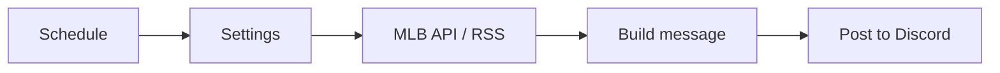

# MetsXMFanZone n8n workflows

Ready-to-import n8n workflows that post New York Mets updates to a Discord
channel. They use the free MLB Stats API and the MLB.com Mets news feed, so you
do not need API keys.

| File | Schedule | What it posts |
| --- | --- | --- |
| `workflows/01-game-day-alert.json` | Every day, 9 AM ET | Opponent, first pitch time, ballpark and probable pitchers. Handles doubleheaders and postponements. Posts nothing on off days. |
| `workflows/02-final-score.json` | Every 10 minutes | Final score, W/L/SV pitchers and the team record, once per game. |
| `workflows/03-daily-news-digest.json` | Every day, 8 AM ET | Mets headlines from the last 24 hours. |
| `workflows/04-stream-health-check.json` | Every 5 minutes | An alert when one of your M3U8 live streams stops playing, and another when it comes back. |



## 1. Start n8n

With Docker installed, run this in this folder:

```bash
docker compose up -d
```

Open <http://localhost:5678> and create your owner account.

## 2. Create a Discord webhook

1. In Discord, open the channel settings.
2. Go to **Integrations > Webhooks > New Webhook**.
3. Click **Copy Webhook URL**.

## 3. Import the workflows

For each JSON file in `workflows/`:

1. In n8n, click **Create workflow**.
2. Open the **...** menu and select **Import from file**.
3. Open the **Settings** node and replace `PASTE_YOUR_DISCORD_WEBHOOK_URL_HERE`
   with your webhook URL.
4. Click **Execute workflow** to test it.
5. Click **Publish** (or turn on **Active**) so that the schedule runs.

You can also import all of them from the command line:

```bash
docker compose exec n8n n8n import:workflow --separate --input=/workflows
```

## Stream health check

The stream health check tests each M3U8 (HLS) URL that you list in its
**Settings** node. For each stream, it:

1. Downloads the playlist and makes sure that it is a valid M3U8 file.
2. If the playlist lists several qualities, opens the highest quality one.
3. Downloads the start of the newest video segment.
4. For a live stream, reloads the playlist after one segment length to make
   sure that new video keeps arriving.

To set it up, open the **Settings** node, paste your Discord webhook URL and
add your streams:

```js
streams: [
  { name: 'Mets Live', url: 'https://example.com/live/master.m3u8' },
  { name: 'Pregame Show', url: 'https://example.com/pregame.m3u8', headers: { Referer: 'https://metsxmfanzone.com' } },
],
```

- **Execute workflow** posts a report for every stream, so you can test a new
  URL right away.
- When the schedule runs, it posts only when a stream goes down and when it
  comes back up. A stream must fail `failuresBeforeAlert` checks in a row
  (default 2) before it counts as down, so one slow response does not alert.
- To pause checks for a stream between events, add `enabled: false` to it.
- Discord messages show the stream name and the problem, not the URL, so
  stream tokens stay private.

## Customize

- **Other team:** change `teamId` in each **Settings** node. For team IDs, see
  <https://statsapi.mlb.com/api/v1/teams?sportId=1>.
- **Other times:** change the cron expression in the schedule node.
- **Other destinations:** replace the **Post to Discord** node with a Slack,
  Telegram, Email or X node. Each workflow gives the text in `message`.

## Notes

- The final score workflow remembers posted games only in production runs.
  A manual test run can post the same game again.
- The workflows set their timezone to `America/New_York`.
